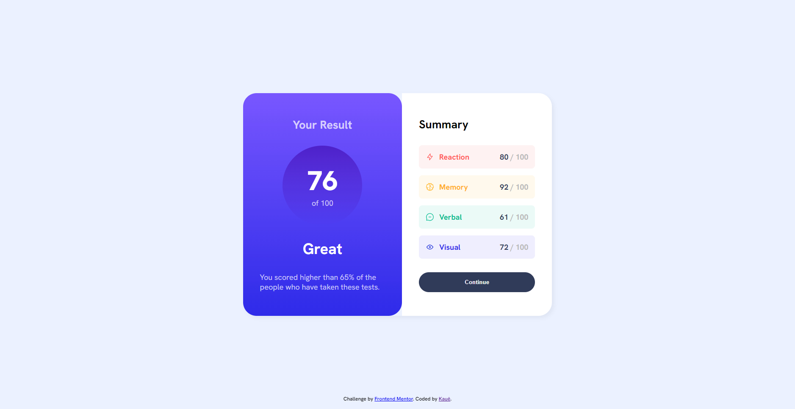

# Frontend Mentor - Results summary component solution

This is a solution to the [Results summary component challenge on Frontend Mentor](https://www.frontendmentor.io/challenges/results-summary-component-CE_K6s0maV). Frontend Mentor challenges help you improve your coding skills by building realistic projects. 

## Table of contents

  - [Screenshot](#screenshot)
  - [Links](#links)
  - [Built with](#built-with)
  - [Continued development](#continued-development)
  - [Author](#author)

### Screenshot

### Links

- Solution URL: [Click here](https://github.com/kauevecchia/results-summary-component)
- Live Site URL: [Click here](https://kauevecchia.github.io/results-summary-component/)

### Built with

- HTML5
- CSS3
- Flexbox

### Continued development

I want to continue developing and applying my web development abilities, like html, css and javascript.

## Author

- Website - [Kauê](https://github.com/kauevecchia)
- Frontend Mentor - [@yourusername](https://www.frontendmentor.io/profile/kauevecchia)

